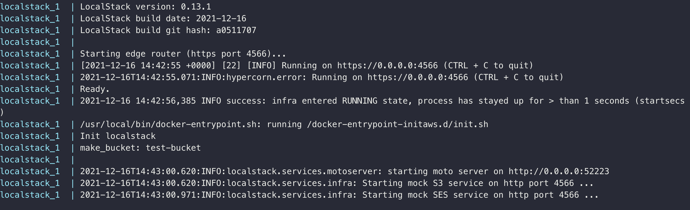
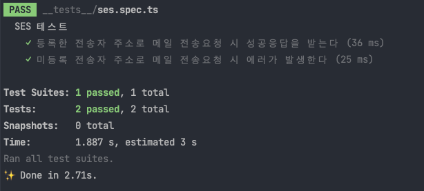

# Loclastack 을 활용한 통합테스트

이 글은 AWS 서비스를 사용하는 로직의 통합테스트를 위해 `localstack` 을 도입하는 과정을 담고 있습니다.

## 통합테스트

유닛테스트 만으로는 소프트웨어가 정상적으로 동작함을 보장할 수 없습니다.
그렇다고 실제 AWS 리소스를 활용하는 경우 다음과 같은 문제가 발생합니다.

1. 비용

테스트가 실행되는 상황은 보통 아래와 같습니다.

- 개발자 각자 로컬에서 실행
- CI / CD

하루에도 수십번의 테스트 실행이 이루어지는 상황에서 매번 AWS 리소스를 사용하다 보면 무시할 수 없는 비용의 문제가 발생할 수 있습니다.

2. secret 관리

실제 AWS 리소스에 접근하려면 `secret access key` 같은 접속정보가 필요합니다.
이를 위해 각 개발자 로컬에 해당 정보를 제공해야 하며 그만큼 유출 가능성이 높아집니다.

3. 테스트간 독립성

올바른 테스트를 위해서는 테스트 케이스간 독립성이 중요합니다.
즉 테스트 순서에 따라 결과가 달라지거나 어떤 테스트의 결과가 다른 테스트에 영향을 끼쳐선 안됩니다.
하지만 하나의 AWS 리소스를 사용하는 경우 테스트의 병렬실행 시 문제가 발생할 수 있습니다.
예로들면 SQS 에 메시지를 넣는 테스트 코드와 빼내는 테스트 코드가 있다면 두 테스트가 동시에 실행되었을 때 타이밍에 따라 빼낸 메시지가 기대했던 값과 달라 때때로 테스트가 실패할 수 있습니다.
이를 해결하기 위해 각 테스트간 다른 AWS 리소스를 사용하도록 할 수 있지만 리소스를 무한정 늘릴 수 없다는 한계가 있습니다.

## Localstack

## Testcontainers 로 실행하기

테스트를 위한 컨테이너를 띄우는 방법으로 [Testcontainers](https://www.testcontainers.org/) 가 있습니다.
이 라이브러리는 이름 그대로 테스트를 위한 컨테이너를 실행해줍니다. 
`java`, `node.js`, `go` 와 같은 여러 프로그래밍 언어를 지원합니다.
`node.js` 에서 사용하는 경우 `beforeAll` 이나 `beforeEach` 에 이 라이브러리를 사용해 컨테이너를 올립니다.

```ts
let localstackPort: number;
let container: GenericContainer;

// 컨테이너 실행
beforeAll(async () => {
  container = await new GenericContainer("localstack/localstack")
    // 내부 4566 포트를 외부의 임의 포트로 노출
    .withExposedPorts(4566)
    // 환경 변수 설정
    .withEnv("SERVICES", "ses")
    // 컨테이너 로그에 이 문구가 나올때까지 기다림
    .withWaitStrategy(Wait.forLogMessage('Execution of "preload_services"'))
    .start();

  localstackPort = container.getMappedPort(4566);
});

// 컨테이너 종료
afterAll(() => container.close());
```

`testcontainers` 는 여러 컨테이너를 동시에 실행시켜도 외부에 노출되는 포트가 중복되지 않게 해줍니다.
따라서 각 테스트 간에 서로 다른 컨테이너에 접속하게 할 수 있기에 병렬실행이 가능하고 테스트 간 독립성이 보장됩니다.
하지만 저희는 testcontainer 대신 docerk-compose 를 활용하기로 결정했고 그 이유는 다음과 같습니다.

- 단건 테스트의 속도가 느려집니다.

테스트 실행여부와 관계없이 항상 컨테이너를 실행해둘 수 있는 docker 방식과 달리 테스트를 실행할 때 컨테이너를 실행하고 테스트 종료 후 마무리 하는 과정이 필요합니다.
이로인해 단건 테스트의 속도가 docker 에 비해 많이 느려집니다.
로컬 환경에서 개발 시 전체 테스트 보다 단건 테스트를 더 많이 수행하게 되므로 생산성 측면에서 오히려 손해라고 판단하였습니다.

- 생각보다 병렬실행의 이점을 얻기 힘듭니다.

testcontainer 를 통해 얻을 수 있는 독립성을 활용해 여러 테스트를 병렬로 실행할 수 있으나 대량의 컨테이터를 올리고 내리는데 드는 부하를 무시할 수 없기에 큰 속도향상을 기대하기 힘든 상황이었습니다.

## Docker compose 로 실행하기

위와 같은 이유로 저희는 docker 로 단일 localstack 을 실행하는 것으로 결정하였고 이제 그 과정을 설명하려고 합니다.

> 예제는 ses 와 s3 를 사용하고 있습니다.
 
### 환경변수 

`localstack` 은 컨테이너 설정을 위해 여러 환경변수를 제공합니다. 
이번 예제에서 사용할 환경변수는 `SERVICE` 로 `localstack` 이 어떤 서비스를 실행할 것인지 설정합니다.
만약 아무런 값을 주지 않으면 모든 서비스를 실행하고 그만큼 시간이 오래 걸리기 때문에 필요한 서비스만 넣는게 좋습니다.
다른 환경변수에 대한 내용은 아래 링크를 참조합니다

- https://hub.docker.com/r/localstack/localstack

### 초기화 스크립트 작성

ses 를 사용하려면 발송인 이메일 주소가 사전에 등록되어 있어야 하고 s3 는 버킷을 만들어야 합니다.
localstack 도 실제 메일을 보내거나 버킷을 만들지는 않지만 등록 api 와 버킷 생성 api 를 사전에 수행하지 않은경우 에러 응답을 내려줍니다.
sdk 를 활용해서 테스트 코드 실행 전 등록 api 를 수행해도 되지만 *초기화 스크립트*를 활용하면 편리하게 사전작업을 할 수 있습니다.
`localstack` 은 컨테이너 실행 시 `/docker-entrypoint-initaws.d` 경로 밑의 스크립트 파일을 읽어 실행합니다.
이를 활용해 먼저 아래 내용의 스크립트를 `localstack-init` 디렉토리 밑에 생성합니다.

- init.sh

```shell
#!/bin/sh
echo "Init localstack"
awslocal s3 mb s3://test-bucket
awslocal ses verify-email-identity --email-address test@email.com
```

`awslocal` 명령어는 `localstack` api 서버에 요청을 하는것을 제외하면 [aws cli](https://aws.amazon.com/ko/cli/) 와 사용법이 동일합니다.
내용을 보면 `test-bucket` 이라는 이름의 버킷을 만들고 `test@email.com` 이메일 주소를 인증하는 작업을 수행하게 됩니다.

### docker-compose.yml 작성

이제 docker compose 파일을 아래와 같이 생성합니다.

- docker-compose.yml

```yaml
version: "3.9"

services:
  localstack:
    image: localstack/localstack
    ports:
      - "4566:4566"
    environment:
      - SERVICES=ses,s3
    container_name: localstack
    volumes:
      - "./localstack-init:/docker-entrypoint-initaws.d"
```

### localstack 실행

이제 아래 명령어를 수행하면 컨테이너가 실행되며 로그를 확인하면 초기화 스크립트를 실행했고 s3 와 ses 서비스가 4566 포트에 올라온 것을 확인할 수 있습니다.

```shell
$ docker-compose up
```



### 테스트 코드

이제 아래와 같은 간단한 테스트 코드를 작성한 후 실행하면 성공하는 것을 확인할 수 있습니다.

```typescript
import { SendEmailCommand, SESClient } from "@aws-sdk/client-ses";

describe("SES 테스트", () => {
  const client = new SESClient({
    region: "local", // 임의의 region 을 주어도 정상동작합니다.
    credentials: { secretAccessKey: "test", accessKeyId: "test" }, // 계정정보도 임의의 값을 주어도 정상동작합니다.
    endpoint: "http://localhost:4566", // localstack 주소로 변경합니다.
  });

  it("등록한 전송자 주소로 메일 전송요청 시 성공응답을 받는다", async () => {
    // given
    const from = "test@email.com";
    const command = new SendEmailCommand({
      Source: from,
      Destination: {
        ToAddresses: ["foo@domain.com"],
      },
      Message: {
        Subject: {
          Data: "메일 제목",
          Charset: "UTF-8",
        },
        Body: {
          Html: {
            Data: "메일 내용",
            Charset: "UTF-8",
          },
        },
      },
    });

    // when
    const response = await client.send(command);

    // then
    expect(response.$metadata.httpStatusCode).toBe(200);
    expect(response.MessageId).toBeTruthy();
  });

  it("미등록 전송자 주소로 메일 전송요청 시 에러가 발생한다", async () => {
    // given
    const from = "invalid@email.com";
    const command = new SendEmailCommand({
      Source: from,
      Destination: {
        ToAddresses: ["foo@domain.com"],
      },
      Message: {
        Subject: {
          Data: "메일 제목",
          Charset: "UTF-8",
        },
        Body: {
          Html: {
            Data: "메일 내용",
            Charset: "UTF-8",
          },
        },
      },
    });

    // when
    const send = () => client.send(command);

    // then
    await expect(send).rejects.toThrowError("MessageRejected");
  });
});
```



## Localstack 사용 시 주의사항

이처럼 localstack 을 이용해면 통합테스트를 하는데 많은 도움을 받을 수 있지만 몇가지 주의해야 사항이 있습니다.

- SES v2 를 지원하지 않음

본 글의 작성일 기준(2021년 12월) 

- 순차 실행

모든 테스트가 하나의 localstack 컨테이너를 사용하기 때문에 독립성을 위해 순차실행을 해야합니다.
`jest` 에서는 순차실행을 위해 `--runInBand` 옵션을 사용합니다.

- CI 에서 localstack 이 완전히 실행된 이후에 테스트 실행해야 함

localstack 은 컨테이너가 실행된 이후에도 초기화 과정이 필요하기 때문에 컨테이너 실행 후 바로 테스트를 실행 시 실패할 수 있습니다.
로컬환경에서는 컨테이너를 계속 실행해두기에 문제가 없지만 CI 에서는 매번 실행하기에 문제가 될 수 있습니다.
이를 해결하기 위해 컨테이너를 최대한 일찍 시작한 후 다른 사전작업을 하면서 완료되기를 기대하거나 
초기화가 완료될 때까지 주기적으로 localstack 으로 http 요청을 수행해 정상응답이 올 때까지 기다리는 방법이 있습니다.
다만 주의할 점은 컨테이너의 `/docker-entrypoint-initaws.d` 경로에 스크립트를 넣은경우 http 서버를 띄운 이후에 해당 스크립트를 실행하기 때문에
이럴때는 컨테이너 로그를 확인해서 해당 스크립트가 실행되었는지 확인해야합니다.


6. AWS 자원을 이용한 통합 테스트 작성의 문제점 (어려운점)
7. 왜 LocalStack을 선택했는지이
   1. aws 를 직접 사용하는건 왜 문제가 되는지
   2. 로컬에서 독립적인 테스트 환경이 왜 필요한 것인지
8. 왜 테스트 컨테이너가 아닌 docker 로 Localstack 실행을 선택했는지
9. Localstack 예제 코드 및 사용법
10. Localstack을 도입하면서 주의해야할 점 (내가 삽질한점)
    1. 이번에 버전 다운그레이드로 해결한 이슈
    2. 컨테이너가 완전히 실행되기를 기다린 후 테스트 실행
11. LocalStack을 도입하면서 얻게된 점 (마치며)
    1. 중간 중간 LocalStack으로 돌린 테스트 로그와 결과물에 대한 캡쳐 이미지
    2. 로컬 스택을 통한 통합 테스트 구조를 그린 이미지
